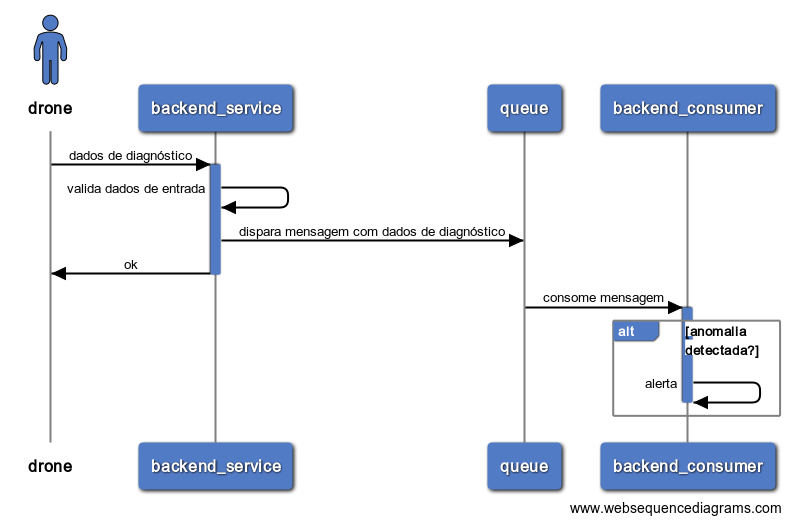
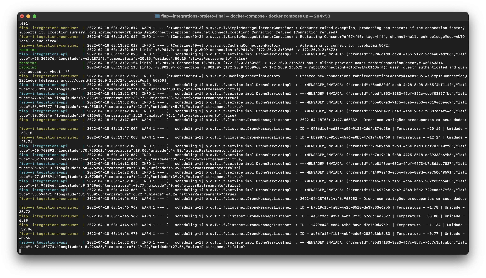

# Drone Status Metrics
## _Trabalho final da disciplina Integrations e Development Tools - FIAP_
#### Turma 42SCJ

Professor: Rafael Thomazelli Mazzucato

Sistema de acompanhamento e análise de drones rurais.

# Integrantes
- Arthur Gomes Araújo
- Felipe Marques dos Santos
- Fernando César Martins
- Flávio Lopes de Brito
- Lucas Oliveira Vaz

# Como Executar (Docker-Compose)

Na raiz do projeto, execute o comando:

- Criar a imagem do projeto e executar os containers
  - Observação: As aplicações terão suas dependências baixadas e serão compiladas dentro do container, sendo necessário apenas ter o docker/docker-compose para executar. Porém, com isso a criação dos containers pode levar alguns minutos. 
> docker-compose up

- Encerrar o ambiente
> docker-compose down

# Postman

Na pasta "postman" na raiz do projeto, esta a collection do Postman para importação

# Arquitetura

# Exemplo de funcionamento

